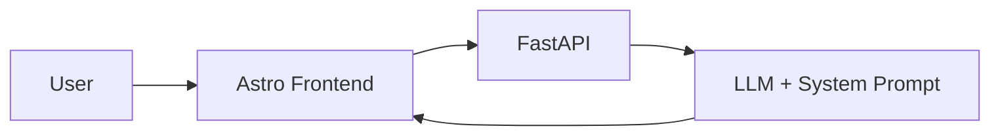
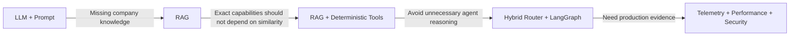
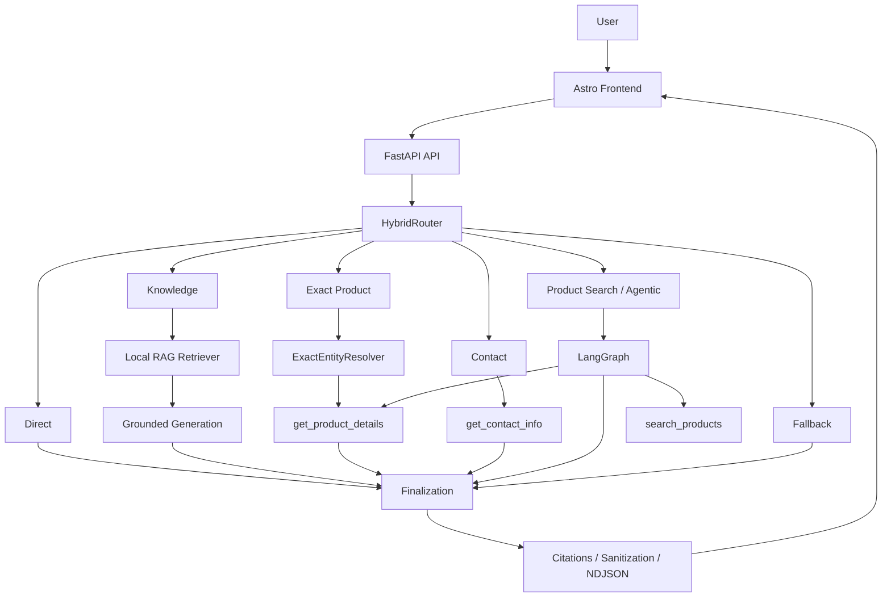

# Production AI Customer Support System

> An AI customer-support system built and deployed for **Shengborun Communications**, combining deterministic routing, local RAG, typed read-only tools, and LangGraph orchestration to answer company-specific questions with measurable reliability and latency.

## Executive Summary

I designed and built an AI customer-support system for **Shengborun Communications**, integrating a FastAPI AI backend with the company's existing public Astro website.

The initial LLM-only system was deliberately conservative but had no authoritative company knowledge source. I evolved it incrementally into a hybrid architecture combining normalized company knowledge, local RAG, exact entity resolution, typed read-only tools, deterministic-first routing, and LangGraph orchestration.

The final system was evaluated separately across retrieval, routing, tool actions, answer quality, performance, and security. In a controlled 132-request representative production-path workload, all 132 requests completed successfully with P50/P95 latency of 1.00/3.156 seconds.

> **Add complexity only when measured failures justify it.**

---

## Project Scope

| | |
|---|---|
| **Role** | AI Systems Engineer / Developer |
| **Organization** | Shengborun Communications |
| **Timeline** | August–September 2026 |
| **Project Type** | Independently designed and developed company project |
| **Ownership** | End-to-end AI architecture, backend implementation, RAG, tools, routing, orchestration, evaluation, observability, performance testing, security testing, deployment, and website integration |
| **Product Context** | Integrated into Shengborun's public Astro website, which I had previously designed and developed as a separate project |
| **Deployment** | FastAPI/Uvicorn service deployed on the company's Ubuntu server behind Nginx and integrated with the public website |

---

## Project at a Glance

| Dimension | Result |
|---|---|
| **Architecture** | Hybrid deterministic/LLM routing + RAG + deterministic tools + LangGraph |
| **Knowledge** | 62 normalized documents · 74 structural chunks · 74 vectors |
| **Agent Evaluation** | **24/24 route decisions** and **24/24 expected tool actions** on the final Dev evaluation |
| **Representative Workload** | **132/132 successful requests** in a controlled production-path workload |
| **Latency** | **P50 1.00 s · P95 3.156 s** in that workload |
| **Regression Verification** | **669/669 backend tests** and **28/28 frontend unit tests** passed on the final audited checkout |
| **Security Evaluation** | **32 internal adversarial runs** across 12 attack families · **0 reviewed boundary breaches** |
| **Streaming Experiment** | Product-search TTFT improved **42.4%**, but total latency regressed **16.9% → not shipped** |

---

# 1. Problem

A customer-support interface makes very different requests look similar:

- “What radio would work well in a hotel?”
- “What is the power output of LY198?”
- “How can I contact the company?”
- “What solutions does the company offer?”
- “Hello.”

But these requests require different execution guarantees.

A recommendation requires semantic relevance. An exact model-number question should not depend on approximate similarity. Contact information should come from a deterministic source. A greeting should not invoke retrieval or an agent.

The core engineering problem was therefore not simply generating text. The system needed to decide when to:

- retrieve semantic evidence,
- resolve an exact entity,
- call a deterministic business tool,
- answer directly,
- use agentic reasoning,
- or fail safely.

At the same time, company-specific answers could not rely on unsupported model knowledge.

---

# 2. Baseline: Conservative but Knowledge-Limited

The initial architecture intentionally contained no RAG pipeline, vector index, tools, or agent framework.



The system prompt constrained the assistant from inventing unsupported company information.

A scripted 20-case baseline produced:

- **2/20 correct**
- **18/20 incorrect**
- all **17 answerable company-knowledge questions were refused**
- 3 outputs also contained unsupported coverage or capability assertions

The important conclusion was not that the prompt itself had failed.

The model had no authoritative company knowledge source. Refusing unsupported product questions was safer than guessing, but it also meant the assistant could not handle legitimate customer questions.

The next missing capability was therefore authoritative **knowledge access**, not a weaker grounding policy.

---

# 3. Architecture Evolution

The architecture changed only when the previous version exposed a concrete limitation.



This was not a progression from “simple AI” to “more advanced AI.”

It was a progression from one generic execution path toward specialized paths with different guarantees.

---

# 4. Capability Impact

The architecture expanded the assistant from an LLM with no authoritative company-data access into a system supporting several distinct customer-service capabilities:

| User Need | Execution Path |
|---|---|
| Exact product specifications | Exact entity resolution + deterministic lookup |
| Product discovery | Semantic product search |
| Company and solution questions | Grounded RAG |
| Contact information | Deterministic contact tool |
| Simple conversational requests | Direct response |
| Unsupported requests | Controlled fallback |

These are capability improvements, not claims about revenue, support-volume reduction, or conversion. Those business outcomes were not measured.

---

# 5. Key Engineering Decisions

## 5.1 Normalize Knowledge Before Embedding It

The source website stores product, solution, support, company, and contact information across structured content.

Instead of allowing JSON, Markdown, or Astro files to define retrieval boundaries, I first normalized them into stable business entities and then produced structural chunks and vector records.

The final audited snapshot contains:

- **62 normalized documents**
- **74 structural chunks**
- **74 vector records**
- **1,024 dimensions per vector**

Documents and chunks carry deterministic identities, hashes, and provenance.

This decouples the knowledge model from presentation and storage formats: a product remains the same knowledge entity even if the website implementation changes.

---

## 5.2 Keep Retrieval Infrastructure Proportional to Scale

The final index contains only 74 vectors.

At this size, distributed vector infrastructure would add operational complexity without solving a demonstrated scaling problem.

The production retriever therefore uses:

- DashScope `qwen3.7-text-embedding`
- local NumPy vectors
- exact cosine similarity
- default Top-K = 5

The current production path does not use:

- a dedicated vector database,
- query rewriting,
- or reranking.

Historical evaluation achieved Hit@5 on all retrieval-eligible Dev, Frozen, and Holdout10 queries; detailed results appear in Section 7. These are historical evaluation results, not production accuracy or an online SLO.

---

## 5.3 Exact Lookup vs. Semantic Retrieval

Consider two requests:

- “What is the power output of LY198?”
- “What radio would work well for a hotel?”

The first already identifies the entity. The second asks the system to discover relevant entities.

Treating both as vector-search problems would introduce unnecessary uncertainty into the first case.

I therefore introduced an `ExactEntityResolver` and three typed, allowlisted, read-only tools:

- `search_products(query)`
- `get_product_details(product_id)`
- `get_contact_info()`

Exact product lookup resolves the canonical product identity and bypasses embeddings. Product discovery continues to use semantic retrieval.

> **When identity is known, resolve identity. When relevance is unknown, rank semantically.**

The tool boundary also constrains execution:

- **Allowlisted:** only registered tools can execute.
- **Typed:** arguments must satisfy explicit schemas.
- **Read-only:** current tools retrieve information but cannot mutate business state.

---

## 5.4 Deterministic-First Hybrid Routing

Once the system contained several execution paths, sending every request through an LLM agent would have introduced avoidable latency, token usage, and nondeterminism.

A purely rule-based router, however, would struggle with ambiguous semantic requests.

The production solution is a **HybridRouter** with six routes:

- `direct`
- `knowledge`
- `exact_product`
- `product_search`
- `contact`
- `fallback`

High-confidence requests are routed deterministically.

Examples:

```text
"Hello"                             → direct
"What is the power of LY198?"       → exact_product
"How can I contact the company?"    → contact
```

Ambiguous requests can fall through to a constrained LLM classifier that is permitted to return only one of the six route labels. Invalid classifier output fails safely to `fallback`.

The router itself does not call embeddings.

Probabilistic reasoning is reserved for cases where deterministic rules do not establish the intent with sufficient confidence.

---

## 5.5 Raw Agent First, LangGraph Later

Before introducing an orchestration framework, I implemented native tool calling directly.

That implementation established and tested the important semantics:

- typed argument validation,
- malformed-call handling,
- unknown-tool rejection,
- structured success/error observations,
- a maximum budget of **3 tool calls per request**,
- atomic rejection of over-budget batches,
- and a final completion with tools disabled after the budget is exhausted.

As the production workflow grew to include routing, retrieval, generation, tool execution, citations, failure paths, and finalization, explicit graph orchestration became useful.

LangGraph then became the production orchestration layer.

The original native implementation remains in the repository as a reference and regression implementation rather than a second production stack.

---

# 6. Final Architecture



The production HTTP interface uses NDJSON records.

The current production path buffers the completed answer and emits it as one final `delta`; token-level streaming is not currently shipped.

---

# 7. Evaluation at the Failure Boundary

Rather than collapsing system quality into a single “accuracy” number, I evaluated separate failure layers independently.

## Retrieval

Historical retrieval evaluation measured whether the required evidence entered the Top-K context:

| Dataset | Hit@1 | Hit@5 |
|---|---:|---:|
| Dev | 22/23 | 23/23 |
| Frozen | 16/18 | 18/18 |
| Holdout10 | 8/9 | 9/9 |

## Routing and Tool Actions

On the **final Dev evaluation**:

- **24/24 correct route decisions**
- **24/24 expected tool actions**

Route accuracy measures whether the system selected the correct execution path.

Action accuracy measures whether the expected tool, call multiplicity, and required arguments were selected.

## Final Answer Quality

A separate **manual Dev answer-quality review** scored:

- **47/48**

Twenty-three cases received full credit, while one received partial credit for an unsupported inference.

This metric was intentionally kept separate from routing and tool-action accuracy: a system can choose the correct action and still produce an imperfect user-facing answer.

---

# 8. Controlled Production-Path Measurement

Once the core behavior was stable, I added request-level telemetry covering:

- total, router, retrieval, tool, and model latency,
- route selection,
- token usage,
- tool calls,
- error/failure state,
- citation state,
- and request IDs.

I then ran a controlled **132-request representative production-style workload** through the production path.

All **132/132 requests completed successfully**, with complete request-level telemetry and token-usage coverage.

Overall latency:

- **P50: 1.00 s**
- **P95: 3.156 s**

Route-level latency:

| Route | P50 | P95 |
|---|---:|---:|
| contact | 844 ms | 1,437 ms |
| direct | 906 ms | 1,359 ms |
| exact_product | 937 ms | 1,375 ms |
| fallback | 15 ms | 2,031 ms |
| knowledge | 1,781 ms | 2,532 ms |
| product_search | 2,235 ms | 3,688 ms |

This was a controlled representative workload, not organic customer traffic or a production SLO.

---

# 9. Finding the Actual Bottleneck

Product search was the slowest regular route.

Its median latency decomposition was approximately:

- total: **2,235 ms**
- model: **1,984 ms**
- tool/retrieval: **157 ms**

The telemetry showed that local retrieval was not the dominant latency component.

Even eliminating most of the 157 ms retrieval time would have had limited impact compared with the model portion.

That evidence changed the next optimization target from retrieval infrastructure to perceived model latency.

---

# 10. A Successful Optimization I Chose Not to Ship

I implemented true token streaming and evaluated it using a predeclared release gate.

For eligible routes, streaming had to:

1. improve P50 time-to-first-token by at least **30%**;
2. improve it by at least **500 ms** in absolute terms;
3. keep total-latency regression within **15%**;
4. preserve correctness and finalization behavior.

The controlled experiment used:

- 3 routes,
- 2 prompts per route,
- 3 repetitions,
- 18 buffered baseline requests,
- 18 streaming requests,
- **36 total requests**.

Results:

| Route | Baseline TTFT | Streaming TTFT | TTFT Change | Total-Latency Change |
|---|---:|---:|---:|---:|
| product_search | 1,844 ms | 1,063 ms | **−42.4%** | **+16.9%** |
| knowledge | 2,187 ms | 1,062 ms | **−51.4%** | **−32.8%** |
| direct | 984 ms | 781 ms | −203 ms | +3.3% |

All correctness and finalization checks passed.

Product-search TTFT improved by **42.4%**, but median total latency increased by **16.9%**, exceeding the predeclared **15%** regression ceiling.

I therefore did not ship the implementation, and the experimental runtime was later removed.

> **Ship against guardrails, not isolated numbers.**

---

# 11. Security Boundaries

Safety-critical execution boundaries are enforced in code rather than relying only on the system prompt.

Examples include:

- invalid requests are rejected before orchestration,
- unknown or malformed tools are not executed,
- over-budget tool batches are rejected atomically,
- rate-limited requests perform no downstream orchestration.

The final **internal adversarial evaluation** covered:

- **12 logical attack families**
- **16 unique adversarial prompts**
- **32 runs**

After review:

- 9 were prevented,
- 23 resulted in safe fallback,
- **0 reviewed boundary breaches were observed**.

This was an internal engineering assessment, not a penetration test or security certification.

---

# 12. Verification

On the final audited checkout:

- **669/669 backend tests passed**, covering routing, retrieval, entity resolution, tool boundaries, agent orchestration, HTTP behavior, citations, telemetry, performance analysis, and security invariants.
- **28/28 frontend unit tests passed.**
- The Playwright suite contained **64 collected E2E cases**; they were not re-executed during the final audit, so I do not claim a current 64/64 E2E pass result.

The project also uses dedicated evaluations for retrieval, routing, tool actions, answer quality, performance, and adversarial behavior rather than treating all failures as generic model errors.

---

# 13. What I Deliberately Did Not Add

The production system does not currently use:

- a distributed vector database,
- query rewriting or reranking,
- multi-agent orchestration or GraphRAG,
- fine-tuning or production LLM-as-a-Judge,
- MCP-based production orchestration.

These technologies were not rejected categorically; the measured scale and failure modes of this project did not justify their additional complexity.

For example, a 74-vector corpus did not require distributed retrieval infrastructure, while known product identities were better handled through deterministic resolution than additional semantic ranking.

---

# 14. Current Limitations

- **Small local retrieval index:** NumPy retrieval is appropriate for the current 74-vector corpus, but the project does not establish performance at substantially larger scale.
- **Process-local admission controls:** rate limiting and concurrency state would require shared infrastructure for multi-instance deployment.
- **Read-only business capabilities:** current tools can search products, retrieve exact product details, and return contact information, but cannot create tickets, modify CRM records, check live inventory, place orders, or perform other write actions.
- **Buffered final delivery:** the API uses an NDJSON transport contract, but production currently returns the completed answer as one buffered delta. True token streaming was intentionally withheld after failing the release guardrail.

Write-capable tools would require additional authorization, confirmation, idempotency, and audit controls.

---

# 15. Lessons

This project reinforced three principles:

1. **Match the execution strategy to the certainty available.** Use deterministic systems when identity or state is known and probabilistic AI when relevance or interpretation is genuinely uncertain.
2. **Measure failures at the layer where they occur.** Retrieval, routing, tool execution, generation, performance, and security require different metrics.
3. **Require evidence for both complexity and optimization.** Add architecture when a measured failure justifies it, and ship changes only when the complete guardrail set supports them.

---

# Tech Stack

**Frontend:** Astro · TypeScript  
**Backend:** FastAPI · Python · Pydantic  
**AI:** DeepSeek · LangGraph · native tool calling  
**Retrieval:** DashScope Embeddings · NumPy cosine search · RAG · ExactEntityResolver  
**Production:** Nginx · systemd · rate limiting · concurrency control · request IDs · request-level telemetry
