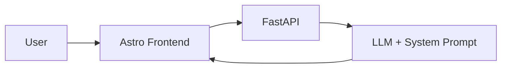
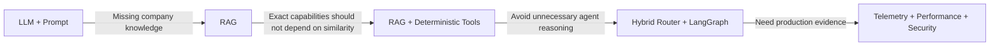
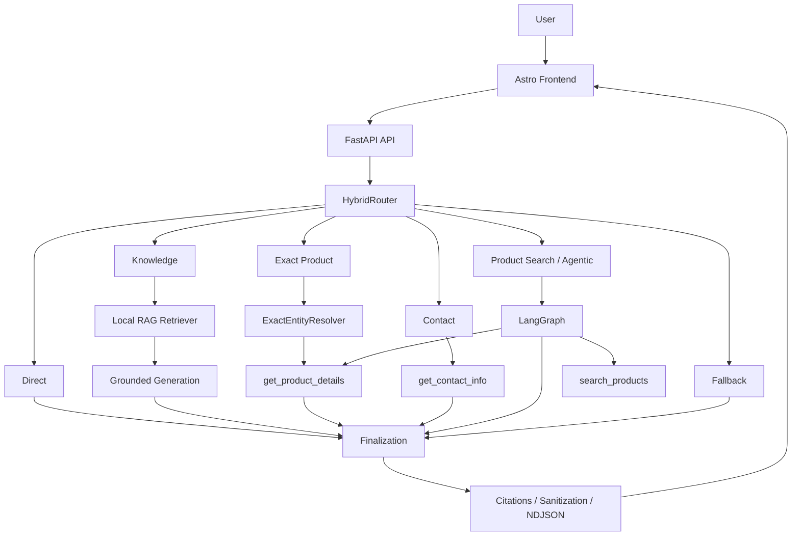

# Production AI Customer Support System

> A production-oriented AI support system that combines deterministic routing, local RAG, typed business tools, and LangGraph orchestration to answer company-specific questions with measurable reliability and latency.

## Executive Summary

I built an AI customer-support system for **Shengborun Communications**, a communications-equipment company whose support experience requires product discovery, exact specification lookup, company knowledge, and contact information.

The project began with the simplest viable architecture: an LLM behind a FastAPI API with behavioral constraints in the system prompt. That system was safe but knowledge-limited. Because it had no authoritative company data source, it correctly tended to refuse specific product questions rather than invent answers.

I progressively evolved the system into a hybrid architecture that separates deterministic capabilities from probabilistic reasoning:

**LLM baseline → RAG → deterministic tools → hybrid routing → LangGraph orchestration → production telemetry and security evaluation**

The central engineering principle was:

> **Add complexity only when measured failures justify it.**

That principle also applied to optimization. I implemented and evaluated true token streaming, but did not ship it after product-search median total latency regressed **16.9%**, exceeding a predeclared **15%** performance guardrail despite a **42.4%** improvement in time-to-first-token.

---

## Project at a Glance

| Dimension               | Result                                                                                      |
| ----------------------- | ------------------------------------------------------------------------------------------- |
| Architecture            | Hybrid deterministic/LLM routing + RAG + deterministic tools + LangGraph                    |
| Knowledge               | 62 normalized documents, 74 structural chunks, 74 vectors                                   |
| Retrieval               | Local NumPy cosine search, Top-K 5                                                          |
| Agent Evaluation        | 24/24 route decisions, 24/24 expected tool actions                                          |
| Representative Workload | 132/132 requests completed successfully                                                     |
| Latency                 | P50 1.00 s, P95 3.156 s                                                                     |
| Final Verification      | 669 backend tests + 28 frontend unit tests passed                                           |
| Security Evaluation     | 32 internal adversarial runs across 12 attack families, 0 reviewed boundary breaches        |
| Performance Decision    | True streaming implemented and evaluated, but not shipped after failing a release guardrail |

---

# 1. Problem

A customer-support interface makes very different requests look identical:

* “What radio would work well in a hotel?”
* “What is the power output of LY198?”
* “How can I contact the company?”
* “What solutions does the company offer?”
* “Hello.”

But these requests require different execution guarantees.

A recommendation requires semantic relevance.

An exact product question should not depend on approximate similarity.

Contact information should come from a deterministic source.

A greeting should not invoke retrieval or an agent.

The core engineering problem became:

> **Different user intents require different execution strategies and different levels of certainty.**

The system therefore needed to decide when to:

* retrieve semantic evidence,
* resolve an exact entity,
* call a business tool,
* answer directly,
* use agentic reasoning,
* or fail safely.

At the same time, company-specific answers could not rely on unsupported model knowledge.

---

# 2. Baseline: Safe but Knowledge-Limited

The initial architecture intentionally contained no RAG pipeline, vector database, tools, or agent framework.



The system prompt constrained the assistant from inventing unsupported company information.

A scripted 20-case baseline produced:

* **2/20 correct**
* **18/20 incorrect**
* all **17 answerable company-knowledge questions were refused**
* 3 outputs also contained unsupported coverage or capability assertions

The important conclusion was not that prompting had failed.

The model simply had no authoritative company knowledge source.

Weakening the prompt would have made the system more willing to answer, but would also have increased the risk of inventing company-specific facts.

The missing capability was therefore **knowledge access**, not greater model confidence.

This led to the first design principle:

> **Behavioral instructions can constrain a model, but they cannot replace missing authoritative data.**

---

# 3. Architecture Evolution

The architecture evolved only when the previous version exposed a measurable limitation.



This was not a progression from “simple AI” to “more advanced AI.”

It was a progression from a one-size-fits-all execution path toward specialized execution based on the guarantees each request required.

---

# 4. Key Engineering Decisions

## 4.1 Normalize Knowledge Before Embedding It

The source website contained structured product, solution, support, company, and contact information.

Instead of treating JSON, Markdown, or Astro files as the knowledge boundary, I created normalized business documents first:

```text
Raw Sources
    ↓
Normalized Business Entities
    ↓
Structural Chunks
    ↓
Embeddings
    ↓
Retrieval Index
```

The audited final snapshot contains:

* **62 normalized documents**
* **74 structural chunks**
* **74 vector records**
* **1,024 dimensions per vector**

Documents carry deterministic identities, hashes, and provenance.

This separates the knowledge model from presentation and storage formats.

A product remains the same knowledge entity even if the website implementation changes later.

> **Knowledge entities should be stable; source-file formats should not define the retrieval model.**

---

## 4.2 Use the Simplest Retrieval Infrastructure That Fits the Scale

The final index contains only 74 vectors.

Introducing distributed vector infrastructure at this size would add operational complexity without solving a demonstrated scaling problem.

The production retriever therefore uses:

* DashScope `qwen3.7-text-embedding`
* local NumPy vectors
* normalized `float32` matrices
* exact cosine similarity
* default Top-K = 5

The production path does not use:

* a vector database,
* query rewriting,
* or a reranker.

Historical evaluation reached 100% Hit@5 on retrieval-eligible Dev, Frozen, and Holdout10 queries.

The decision was not that NumPy is universally superior to a vector database.

It was that:

> **Infrastructure complexity should follow actual scale and failure evidence.**

---

## 4.3 Exact Identity Should Not Be Treated as Semantic Similarity

Consider two requests:

```text
"What is the power output of LY198?"
```

and:

```text
"What radio would work well in a hotel?"
```

The first request already identifies the entity.

The second asks the system to discover relevant entities.

Treating both as vector-search problems adds unnecessary uncertainty to the first case.

I therefore introduced an `ExactEntityResolver` and three deterministic business tools:

* `search_products(query)`
* `get_product_details(product_id)`
* `get_contact_info()`

For exact product lookup:

```text
LY198
  ↓
ExactEntityResolver
  ↓
Canonical Product Identity
  ↓
get_product_details()
```

This path bypasses embeddings.

For product discovery:

```text
"radio for a hotel"
  ↓
search_products()
  ↓
Semantic Retrieval
  ↓
Ranked Product Candidates
```

This established one of the project's most important design rules:

> **When identity is known, resolve identity. When relevance is unknown, rank semantically.**

The tools are also:

* **allowlisted** — only registered tools can execute,
* **typed** — arguments must satisfy explicit schemas,
* **read-only** — tools retrieve data but cannot mutate business state.

---

## 4.4 Route Deterministically Before Asking an LLM

Once the system contained multiple execution paths, sending every request through an LLM agent would have created unnecessary latency, token usage, and nondeterminism.

A purely rule-based router, however, would struggle with semantically ambiguous requests.

The production solution is a **HybridRouter**.

The six routes are:

* `direct`
* `knowledge`
* `exact_product`
* `product_search`
* `contact`
* `fallback`

High-confidence requests are routed deterministically.

```text
"Hello"
→ direct

"What is the power of LY198?"
→ exact_product

"How can I contact the company?"
→ contact
```

Ambiguous requests can fall through to a constrained LLM classifier.

That classifier is only allowed to return one of the six route labels. Invalid output fails safely to `fallback`.

The router itself does not call embeddings.

The design principle is:

> **Do not ask an LLM to decide what ordinary code already knows reliably.**

Probabilistic reasoning is reserved for genuine ambiguity.

---

## 4.5 Understand the Agent Loop Before Introducing LangGraph

I initially implemented native tool calling directly:

```text
LLM
 ↓
Tool Call
 ↓
ToolExecutor
 ↓
Structured Observation
 ↓
LLM
```

This exposed the core control semantics instead of hiding them behind a framework.

The raw implementation includes:

* typed argument validation,
* malformed-call handling,
* unknown-tool rejection,
* structured success/error observations,
* a maximum budget of **3 tool calls per request**,
* atomic rejection of over-budget batches,
* and a final completion with tools disabled after the budget is exhausted.

As the production workflow grew to include routing, retrieval, generation, tools, citations, failure paths, and finalization, explicit graph orchestration became useful.

LangGraph then became the production orchestration layer.

The original native agent remains a reference and regression implementation.

> **The framework expresses the architecture; it does not define the business logic.**

---

# 5. Final Architecture



The production HTTP interface uses NDJSON records.

The current production path buffers the completed answer and returns it as one final `delta`; token-level streaming is not currently shipped.

---

# 6. Evaluation at the Failure Boundary

Rather than using a single generic “accuracy” score, I evaluated different layers independently.

## Retrieval

Historical retrieval evaluation:

| Dataset   | Hit@1 | Hit@5 |
| --------- | ----: | ----: |
| Dev       | 22/23 | 23/23 |
| Frozen    | 16/18 | 18/18 |
| Holdout10 |   8/9 |   9/9 |

This measured whether the required evidence entered the retrieval context.

## Routing and Tool Actions

Final Dev evaluation:

* **24/24 correct route decisions**
* **24/24 expected tool actions**

These metrics measure different things.

Route accuracy asks whether the system chose the correct execution path.

Action accuracy asks whether the expected tool, multiplicity, and required arguments were selected.

## Final Answer Quality

A separate manual answer-quality review scored:

* **47/48**

This was intentionally kept separate from routing and action accuracy so that a correct tool choice could still be distinguished from a poor final response.

## Regression Verification

On the final audited checkout:

* **669/669 backend tests passed**
* **28/28 frontend unit tests passed**

The final Playwright suite contained 64 collected E2E cases, but they were not re-executed during the final audit, so I do not claim a current 64/64 pass result.

---

# 7. Production Measurement

Once the core architecture was stable, I added request-level telemetry to answer a different class of questions:

* Which routes are slow?
* Is retrieval the bottleneck?
* How much time is spent in the model?
* How many tokens does each request consume?
* Are tools failing?
* Are citations being produced correctly?

The production telemetry records information including:

* total latency,
* router latency,
* retrieval latency,
* tool latency,
* model latency,
* route,
* token usage,
* tool calls,
* error/failure state,
* citation state,
* and request IDs.

---

## Representative Workload

I ran a controlled **132-request representative production-style workload** through the production path.

Results:

* **132 attempted**
* **132 successful**
* **0 failed**
* **0 skipped**
* telemetry coverage: **132/132**
* token coverage: **132/132**
* estimated-cost coverage: **132/132**

Overall latency:

* **P50: 1.00 s**
* **P95: 3.156 s**

Route-level latency:

| Route          |      P50 |      P95 |
| -------------- | -------: | -------: |
| contact        |   844 ms | 1,437 ms |
| direct         |   906 ms | 1,359 ms |
| exact_product  |   937 ms | 1,375 ms |
| fallback       |    15 ms | 2,031 ms |
| knowledge      | 1,781 ms | 2,532 ms |
| product_search | 2,235 ms | 3,688 ms |

This was a controlled representative workload, not organic customer traffic or a production SLO.

---

# 8. Finding the Actual Bottleneck

Product search was the slowest regular execution route.

Its median latency decomposition was approximately:

* total: **2,235 ms**
* model: **1,984 ms**
* tool/retrieval: **157 ms**

This changed the optimization direction.

The obvious AI-system instinct might have been to optimize vector retrieval.

But the telemetry showed that retrieval was not the dominant component.

Even eliminating most of the 157 ms retrieval time would have had limited impact compared with the model portion.

The next experiment therefore targeted **perceived model latency**, not retrieval infrastructure.

---

# 9. A Successful Optimization I Chose Not to Ship

I implemented true token streaming to test whether users could receive useful output earlier.

Before running the experiment, I defined release criteria.

For eligible routes, streaming had to:

1. improve P50 time-to-first-token by at least **30%**;
2. improve it by at least **500 ms** in absolute terms;
3. keep total-latency regression within **15%**;
4. preserve correctness and finalization behavior.

The controlled experiment contained:

* 3 routes,
* 2 prompts per route,
* 3 repetitions,
* 18 buffered baseline requests,
* 18 streaming requests,
* **36 total requests**.

Results:

| Route          | Baseline TTFT | Streaming TTFT | TTFT Change | Total-Latency Change |
| -------------- | ------------: | -------------: | ----------: | -------------------: |
| product_search |      1,844 ms |       1,063 ms |  **−42.4%** |           **+16.9%** |
| knowledge      |      2,187 ms |       1,062 ms |  **−51.4%** |           **−32.8%** |
| direct         |        984 ms |         781 ms |     −203 ms |                +3.3% |

All correctness and finalization checks passed.

At first glance, streaming looked successful.

Product-search TTFT improved by **42.4%**.

However, its median total latency increased by **16.9%**, above the predeclared **15%** regression ceiling.

I therefore did not ship it.

The experimental runtime was later removed.

> **An optimization can improve one attractive metric and still make the overall system worse. Ship against guardrails, not isolated numbers.**

---

# 10. Security Boundaries

AI safety in this project is not enforced only through the system prompt.

Critical execution boundaries are deterministic.

Examples include:

```text
Invalid request
→ rejected before orchestration

Unknown or malformed tool
→ no tool execution

Over-budget tool batch
→ rejected atomically

Rate-limited request
→ no downstream orchestration
```

The final internal adversarial evaluation covered:

* **12 logical attack families**
* **16 unique adversarial prompts**
* **32 runs**
* **0 reviewed boundary breaches**

Reviewed outcomes included:

* 9 prevented,
* 23 safe fallbacks,
* 0 observed boundary breaches.

This was an internal engineering assessment, not a penetration test or security certification.

---

# 11. What I Deliberately Did Not Add

The final production system does not use several common AI-system components:

* distributed vector infrastructure,
* reranking or query rewriting,
* multi-agent orchestration or GraphRAG,
* fine-tuning,
* production LLM-as-a-Judge,
* MCP-based production orchestration.

These technologies are not inherently unnecessary.

They were simply not justified by the measured requirements of this system.

With only 74 vectors, a distributed vector database would add complexity without solving a current bottleneck.

Exact product identities do not need semantic reranking.

The current business workflow does not require multiple autonomous agents.

> **The goal was not to maximize the number of AI components. It was to build the minimum architecture supported by observed requirements.**

---

# 12. Current Limitations

## Small Local Retrieval Index

The final knowledge snapshot contains only 74 vectors.

Local NumPy retrieval is appropriate at this scale, but this project does not establish that the same architecture would remain appropriate for a much larger corpus.

## Process-Local Admission Controls

Rate limiting and concurrency control are maintained per process.

A horizontally scaled deployment would require shared state for globally consistent enforcement.

## Read-Only Business Capabilities

The current tools can:

* search products,
* retrieve exact product details,
* return contact information.

They cannot currently:

* create support tickets,
* modify CRM records,
* check live inventory,
* place orders,
* or perform other external write actions.

Adding write-capable tools would require stronger authorization, confirmation, idempotency, and audit controls.

## Buffered Final Delivery

The API has an NDJSON transport contract, but production currently returns the completed answer as one buffered delta.

True token streaming was intentionally withheld after failing the release performance guardrail.

---

# 13. Lessons

Three principles summarize the project.

### 1. Match the execution strategy to the certainty available

Use deterministic systems when identity or state is known.

Use probabilistic retrieval or reasoning when relevance or interpretation is genuinely uncertain.

### 2. Measure failures at the layer where they occur

Retrieval quality, routing correctness, tool execution, answer quality, latency, and security are different problems and require different metrics.

### 3. Complexity and optimization require evidence

Do not add architecture because it is fashionable.

Do not ship an optimization because one metric improved.

Add complexity when a measured failure justifies it, and ship changes only when the complete guardrail set supports them.

---

# Tech Stack

**Frontend:** Astro · TypeScript
**Backend:** FastAPI · Python · Pydantic
**AI:** DeepSeek · LangGraph · native tool calling
**Retrieval:** DashScope Embeddings · NumPy cosine search · RAG · ExactEntityResolver
**Production:** Nginx · systemd · rate limiting · concurrency control · request telemetry
