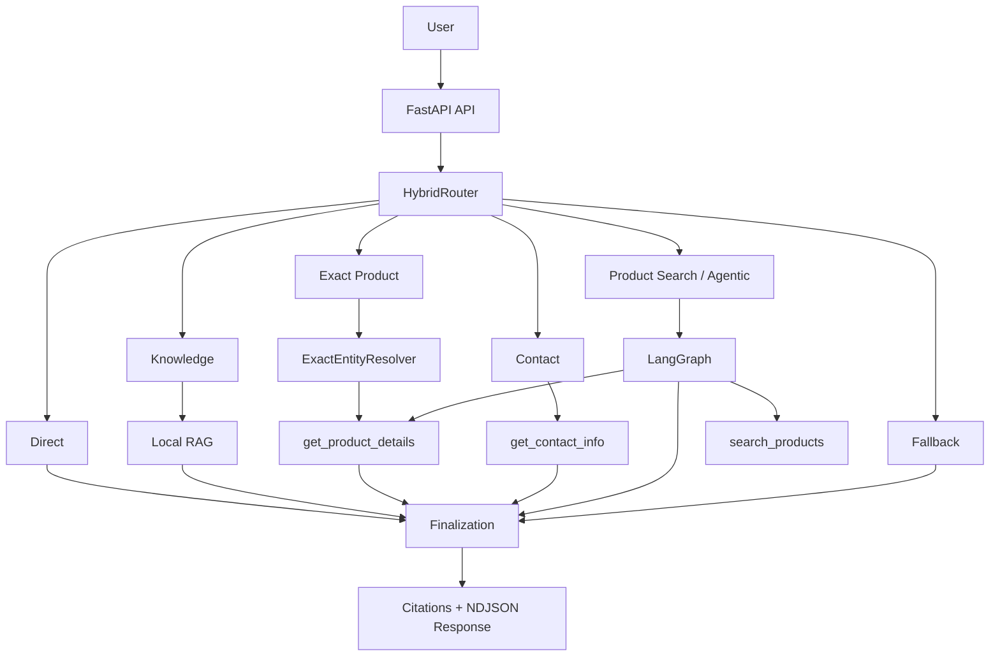

# Production AI Customer Support System

A production AI customer-support system built for **Shengborun Communications**, combining deterministic routing, local RAG, typed read-only tools, and LangGraph orchestration to answer product, company, support, and contact questions through specialized execution paths.

**Live Website:** [shengborun.com](https://www.shengborun.com/)  
**Corporate Website Repository:** [TLzmmmmmmmm/Shengborun](https://github.com/TLzmmmmmmmm/Shengborun)  
**Full Engineering Case Study:** [CASE_STUDY.md](./CASE_STUDY.md)

> **Core principle:** Add complexity only when measured failures justify it.

---

## Results at a Glance

| Area | Result |
|---|---|
| **Agent Evaluation** | **24/24 route decisions** and **24/24 expected tool actions** on the final Dev evaluation |
| **Representative Workload** | **132/132 requests completed successfully** |
| **Latency** | **P50 1.00 s · P95 3.156 s** in a controlled representative workload |
| **Backend Verification** | **669/669 tests passed** |
| **Frontend Verification** | **28/28 unit tests passed** |
| **Security Evaluation** | **32 internal adversarial runs** across 12 attack families, with **0 reviewed boundary breaches** |
| **Streaming Experiment** | Product-search TTFT improved **42.4%**, but total latency regressed **16.9%**, so the optimization was not shipped |

> Performance results come from controlled representative production-path workloads, not organic customer traffic or production SLOs.

---

## Role & Ownership

| | |
|---|---|
| **Role** | AI Systems Engineer / Developer |
| **Organization** | Shengborun Communications |
| **Timeline** | August–September 2026 |
| **Project Type** | Independently designed and developed company project |
| **Ownership** | End-to-end AI architecture, FastAPI backend, RAG pipeline, deterministic tools, hybrid routing, LangGraph orchestration, evaluation, observability, performance testing, security testing, deployment, and website integration |
| **Product Context** | Integrated into Shengborun's public corporate website, which I had previously designed and developed as a separate Astro/TypeScript project |
| **Deployment** | FastAPI/Uvicorn service deployed on the company's Ubuntu server behind Nginx and integrated with the public website |

---

## Demo

> The production interface is Chinese because Shengborun primarily serves customers in mainland China.


**Query:** `对讲机 LY198 的技术参数是什么？`  
*What are the technical specifications of the LY198 radio?*

The assistant resolves `LY198` as an exact product entity, returns the documented specifications, and cites the corresponding company product page.

---

## Architecture

Different customer requests require different execution guarantees.

| User Need | Execution Path |
|---|---|
| Exact product specifications | Exact entity resolution + deterministic lookup |
| Product discovery | Semantic product search |
| Company / solution questions | Grounded RAG |
| Contact information | Deterministic contact tool |
| Simple conversational requests | Direct response |
| Unsupported requests | Controlled fallback |

The production system uses a six-route **HybridRouter**:



High-confidence requests are routed deterministically. Ambiguous requests may use a constrained LLM classifier that can return only one of the six supported routes.

---

## Key Engineering Decisions

| Decision | Alternative | Reason |
|---|---|---|
| **Local NumPy cosine index** | Dedicated vector database | The current index contains only 74 vectors; distributed retrieval infrastructure was not justified by scale |
| **Exact entity lookup** | Semantic search for every product query | Known identities should be resolved deterministically rather than ranked probabilistically |
| **Hybrid routing** | LLM agent for every request | Reduces unnecessary model latency, token usage, and nondeterminism |
| **Typed, read-only tools** | Free-form or write-capable tools | Current business scope did not justify authorization and mutation complexity |
| **Buffered production response** | True token streaming | Streaming failed the predefined total-latency release guardrail |

> **When identity is known, resolve identity. When relevance is unknown, rank semantically.**

---

## RAG & Knowledge Pipeline

Current audited snapshot:

- **62 normalized documents**
- **74 structural chunks**
- **74 vector records**
- **1,024 dimensions per vector**
- DashScope `qwen3.7-text-embedding`
- NumPy exact cosine similarity
- default Top-K = 5

The current retrieval path intentionally does **not** use a vector database, query rewriting, or reranking.

Historical Hit@5 results on retrieval-eligible queries:

- Dev: **23/23**
- Frozen: **18/18**
- Holdout10: **9/9**

---

## Deterministic Tools

The system exposes three typed, allowlisted, read-only tools:

```text
search_products(query)
get_product_details(product_id)
get_contact_info()
```

Exact product lookup bypasses semantic retrieval.

The agent is limited to **3 tool calls per request**. Malformed, unauthorized, or over-budget tool calls fail safely.

---

## Controlled Production-Path Measurement

A controlled representative production-style workload completed **132/132 requests successfully with complete request-level telemetry and token-usage coverage**.

Latency:

| Route | P50 | P95 |
|---|---:|---:|
| **Overall** | **1,000 ms** | **3,156 ms** |
| contact | 844 ms | 1,437 ms |
| direct | 906 ms | 1,359 ms |
| exact_product | 937 ms | 1,375 ms |
| knowledge | 1,781 ms | 2,532 ms |
| product_search | 2,235 ms | 3,688 ms |

For product search, median model execution was approximately **1,984 ms** of **2,235 ms** total latency, while tool/retrieval time was approximately **157 ms**.

The measurement showed that model execution—not the local retrieval index—was the dominant latency component.

---

## A Feature I Chose Not to Ship

I implemented true token streaming and evaluated it using a predeclared 36-request release gate.

For product search:

```text
TTFT
1,844 ms → 1,063 ms
42.4% improvement
```

But:

```text
Total latency
1,844 ms → 2,156 ms
16.9% regression
```

The maximum allowed total-latency regression was **15%**.

All correctness and finalization checks passed, but the performance guardrail did not.

I therefore retained the buffered production path and removed the unused streaming implementation.

> **Ship against guardrails, not isolated numbers.**

---

## Verification

On the final audited checkout:

- **669/669 backend tests passed**, covering routing, retrieval, entity resolution, tool boundaries, agent orchestration, HTTP behavior, citations, telemetry, performance analysis, and security invariants
- **28/28 frontend unit tests passed**
- The Playwright suite contained 64 collected E2E cases; they were not re-executed during the final audit, so I do not claim a current 64/64 E2E result

Internal adversarial evaluation:

- **12 logical attack families**
- **16 unique adversarial prompts**
- **32 runs**
- **0 reviewed boundary breaches**

This was an internal engineering assessment, not a penetration test or security certification.

---

## Current Limitations

- **Small local index:** NumPy retrieval is appropriate for the current 74-vector corpus, but the project does not establish large-scale retrieval performance.
- **Process-local controls:** rate limiting and concurrency state would require shared infrastructure for multi-instance deployment.
- **Read-only tools:** the system cannot yet create support tickets, modify CRM records, check live inventory, or perform other external write actions.
- **Buffered delivery:** token-level streaming was tested but intentionally withheld after failing the performance release guardrail.

---

## Run Locally

Requires Python 3.12 and a `.env` file containing `DEEPSEEK_API_KEY`, `DASHSCOPE_API_KEY`, and `DASHSCOPE_WORKSPACE_ID`.

```bash
python -m venv .venv
source .venv/bin/activate  # Windows: .venv\Scripts\activate
python -m pip install -r requirements.txt
python scripts/build_embeddings.py --execute  # paid embedding API call
python -m uvicorn main:app --reload
```

The API is then available at `http://127.0.0.1:8000`; verify it with `GET /health`.

---

## Tech Stack

**Frontend:** Astro · TypeScript  
**Backend:** FastAPI · Python · Pydantic  
**AI:** DeepSeek · LangGraph · native tool calling  
**Retrieval:** DashScope Embeddings · NumPy · RAG · ExactEntityResolver  
**Production:** Nginx · systemd · request IDs · rate limiting · concurrency control · request telemetry

---

## Repositories & Documentation

- **Corporate Website:** [Shengborun](https://github.com/TLzmmmmmmmm/Shengborun)
- **Live Website:** [shengborun.com](https://www.shengborun.com/)
- **Engineering Deep Dive:** [CASE_STUDY.md](./CASE_STUDY.md)
