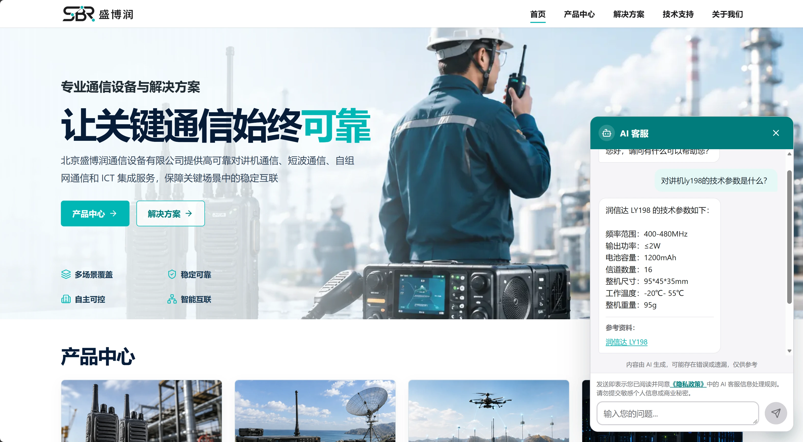
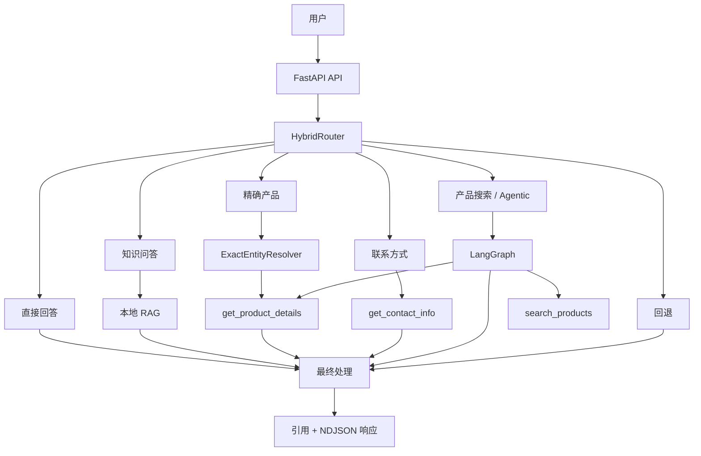

# 生产级 AI 客户支持系统

[English](README.md)

这是一个为北京盛博润通信设备有限公司构建的生产级 AI 客户支持系统。系统结合确定性路由、本地 RAG、带类型约束的只读工具和 LangGraph 编排，通过专门的执行路径回答产品、公司、技术支持和联系方式等问题。

**线上网站：** [shengborun.com](https://www.shengborun.com/)  
**公司网站仓库：** [TLzmmmmmmmm/Shengborun](https://github.com/TLzmmmmmmmm/Shengborun)  
**完整工程案例：** [CASE_STUDY.md](./CASE_STUDY.md)

> **核心原则：** 只有经过测量的问题能够证明复杂度合理时，才增加复杂度。

---

## 结果概览

| 领域 | 结果 |
|---|---|
| **Agent 评测** | 最终 Dev 评测中，**24/24 路由决策**和 **24/24 预期工具操作**正确 |
| **代表性工作负载** | **132/132 个请求成功完成** |
| **延迟** | 受控代表性工作负载中，**P50 1.00 秒 · P95 3.156 秒** |
| **后端验证** | **669/669 项测试通过** |
| **前端验证** | **28/28 项单元测试通过** |
| **安全评测** | 覆盖 12 类攻击的 **32 次内部对抗运行**，经审查的边界突破为 **0** |
| **流式实验** | 产品搜索 TTFT 改善 **42.4%**，但总延迟回退 **16.9%**，因此未发布该优化 |

> 性能结果来自受控的代表性生产路径工作负载，不是自然客户流量，也不是生产 SLO。

---

## 角色与职责

| | |
|---|---|
| **角色** | AI 系统工程师 / 开发者 |
| **组织** | 盛博润通信 |
| **时间** | 2026 年 8 月至 9 月 |
| **项目类型** | 独立设计和开发的公司项目 |
| **职责范围** | 端到端 AI 架构、FastAPI 后端、RAG 流程、确定性工具、混合路由、LangGraph 编排、评测、可观测性、性能测试、安全测试、部署和网站集成 |
| **产品背景** | 集成到盛博润公开的公司网站；该网站是我此前独立设计和开发的 Astro/TypeScript 项目 |
| **部署方式** | FastAPI/Uvicorn 服务部署在公司的 Ubuntu 服务器上，位于 Nginx 之后，并与公开网站集成 |

---

## 演示

> 由于盛博润主要服务中国大陆客户，生产界面使用中文。



**问题：** `对讲机 LY198 的技术参数是什么？`

系统将 `LY198` 解析为精确产品实体，返回资料中记录的技术参数，并引用相应的公司产品页面。

---

## 架构

不同类型的客户请求需要不同的执行保证。

| 用户需求 | 执行路径 |
|---|---|
| 精确产品参数 | 精确实体解析 + 确定性查询 |
| 产品发现 | 语义产品搜索 |
| 公司 / 解决方案问题 | 有依据的 RAG |
| 联系方式 | 确定性联系工具 |
| 简单对话请求 | 直接回答 |
| 不支持的请求 | 受控回退 |

生产系统使用包含六条路由的 **HybridRouter**：



高置信度请求通过确定性规则路由。存在歧义的请求可以交给受约束的 LLM 分类器，但分类器只能返回六种受支持路由中的一种。

---

## 关键工程决策

| 决策 | 替代方案 | 原因 |
|---|---|---|
| **本地 NumPy 余弦索引** | 专用向量数据库 | 当前索引只有 74 个向量，规模不足以证明分布式检索基础设施的必要性 |
| **精确实体查询** | 所有产品问题都使用语义搜索 | 身份已知时应进行确定性解析，而不是相关性排序 |
| **混合路由** | 每个请求都使用 LLM Agent | 减少不必要的模型延迟、Token 消耗和不确定性 |
| **带类型约束的只读工具** | 自由格式或可写工具 | 当前业务范围不足以证明授权和修改能力所带来的复杂度合理 |
| **生产环境缓冲响应** | 真正的 Token 流式响应 | 流式方案未通过预先定义的总延迟发布门槛 |

> **身份已知时解析身份，相关性未知时进行排序。**

---

## RAG 与知识流程

当前已审计快照：

- **62 个规范化文档**
- **74 个结构化知识块**
- **74 条向量记录**
- 每个向量 **1,024 维**
- DashScope `qwen3.7-text-embedding`
- NumPy 精确余弦相似度
- 默认 Top-K = 5

当前检索路径有意不使用向量数据库、查询改写或重排序。

历史上，在适用检索的问题中，Hit@5 结果为：

- Dev：**23/23**
- Frozen：**18/18**
- Holdout10：**9/9**

---

## 确定性工具

系统提供三个带类型约束、列入允许列表且只读的工具：

```text
search_products(query)
get_product_details(product_id)
get_contact_info()
```

精确产品查询绕过语义检索。

每个请求最多允许 Agent 调用工具 **3 次**。格式错误、未经授权或超出预算的工具调用会安全失败。

---

## 受控生产路径测量

受控、具有代表性的生产风格工作负载完成了 **132/132 个请求**，并获得完整的请求级遥测和 Token 用量覆盖。

延迟：

| 路由 | P50 | P95 |
|---|---:|---:|
| **整体** | **1,000 ms** | **3,156 ms** |
| contact | 844 ms | 1,437 ms |
| direct | 906 ms | 1,359 ms |
| exact_product | 937 ms | 1,375 ms |
| knowledge | 1,781 ms | 2,532 ms |
| product_search | 2,235 ms | 3,688 ms |

在产品搜索路径中，模型执行中位数约为 **1,984 ms**，总延迟中位数为 **2,235 ms**；工具和检索时间约为 **157 ms**。

测量结果表明，主要延迟来自模型执行，而不是本地检索索引。

---

## 一个没有发布的功能

我实现了真正的 Token 流式响应，并使用预先声明的 36 请求发布门槛进行评测。

产品搜索路径：

```text
TTFT
1,844 ms → 1,063 ms
改善 42.4%
```

但是：

```text
总延迟
1,844 ms → 2,156 ms
回退 16.9%
```

允许的最大总延迟回退为 **15%**。

所有正确性检查和最终处理检查都通过了，但性能门槛未通过。

因此，我保留了生产环境的缓冲响应路径，并移除了未使用的流式实现。

> **依据门槛发布，而不是依据孤立指标发布。**

---

## 验证

在最终审计的代码版本上：

- **669/669 项后端测试通过**，覆盖路由、检索、实体解析、工具边界、Agent 编排、HTTP 行为、引用、遥测、性能分析和安全不变量
- **28/28 项前端单元测试通过**
- Playwright 测试套件收集了 64 个 E2E 用例，但最终审计期间没有重新运行，因此不宣称当前达到 64/64 E2E 通过

内部对抗评测：

- **12 个逻辑攻击类别**
- **16 个不同的对抗提示词**
- **32 次运行**
- **0 次经审查的边界突破**

这是内部工程评估，不是渗透测试或安全认证。

---

## 当前限制

- **本地索引规模较小：** NumPy 检索适合当前的 74 向量语料库，但本项目没有验证大规模检索性能。
- **进程内控制：** 如果部署多个实例，限流和并发状态需要使用共享基础设施。
- **只读工具：** 系统目前无法创建支持工单、修改 CRM 记录、查询实时库存或执行其他外部写入操作。
- **缓冲响应：** Token 级流式响应已经过测试，但因未通过性能发布门槛而有意不启用。

---

## 本地运行

需要 Python 3.12，以及包含 `DEEPSEEK_API_KEY`、`DASHSCOPE_API_KEY` 和 `DASHSCOPE_WORKSPACE_ID` 的 `.env` 文件。

```bash
python -m venv .venv
source .venv/bin/activate  # Windows：.venv\Scripts\activate
python -m pip install -r requirements.txt
python scripts/build_embeddings.py --execute  # 会调用付费的 embedding API
python -m uvicorn main:app --reload
```

API 随后可通过 `http://127.0.0.1:8000` 访问；使用 `GET /health` 验证服务状态。

---

## 技术栈

**前端：** Astro · TypeScript  
**后端：** FastAPI · Python · Pydantic  
**AI：** DeepSeek · LangGraph · 原生工具调用  
**检索：** DashScope Embeddings · NumPy · RAG · ExactEntityResolver  
**生产环境：** Nginx · systemd · 请求 ID · 限流 · 并发控制 · 请求遥测

---

## 仓库与文档

- **公司网站：** [Shengborun](https://github.com/TLzmmmmmmmm/Shengborun)
- **线上网站：** [shengborun.com](https://www.shengborun.com/)
- **工程深度解析：** [CASE_STUDY.md](./CASE_STUDY.md)
